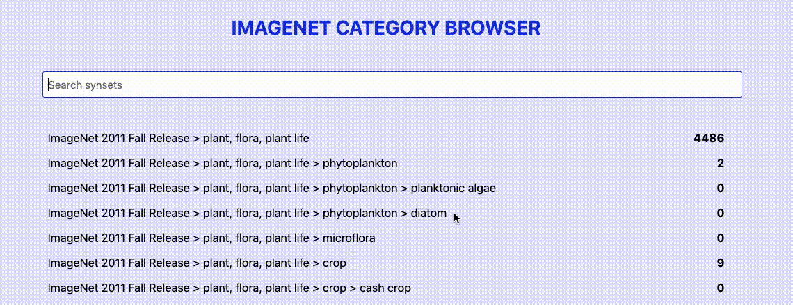

## Imagenet browser

Loading categories from [imagenet.stanford.edu](http://imagenet.stanford.edu/)...

### Stack

- FE: React (Next) + Flow + Styled components
- BE: Python + Docker + [CouchDB](https://couchdb.apache.org/)

### Functionality
- Crawls Imagenet synsets
- Converts from list to tree structure
  - time complexity = O(N * M * O * S) ~= O(N^3)
    - N = size of the entries in the list
    - M = max nested entry (approx constant)
    - O = max children in a category
    - S = time of couchdb client to update doc entry (dummy implementation is O(N), can be optimized by indices)
- CouchDB has built-in REST API with Search

### What can be done for improvement
- faster data fetching/converting in parallel
- graphQL API
- tests (unit tests for FE + BE, E2E tests for FE)
- improved security and performance of CouchDB
- nicer frontend with toggleable categories and cached requests (and images possibly)
